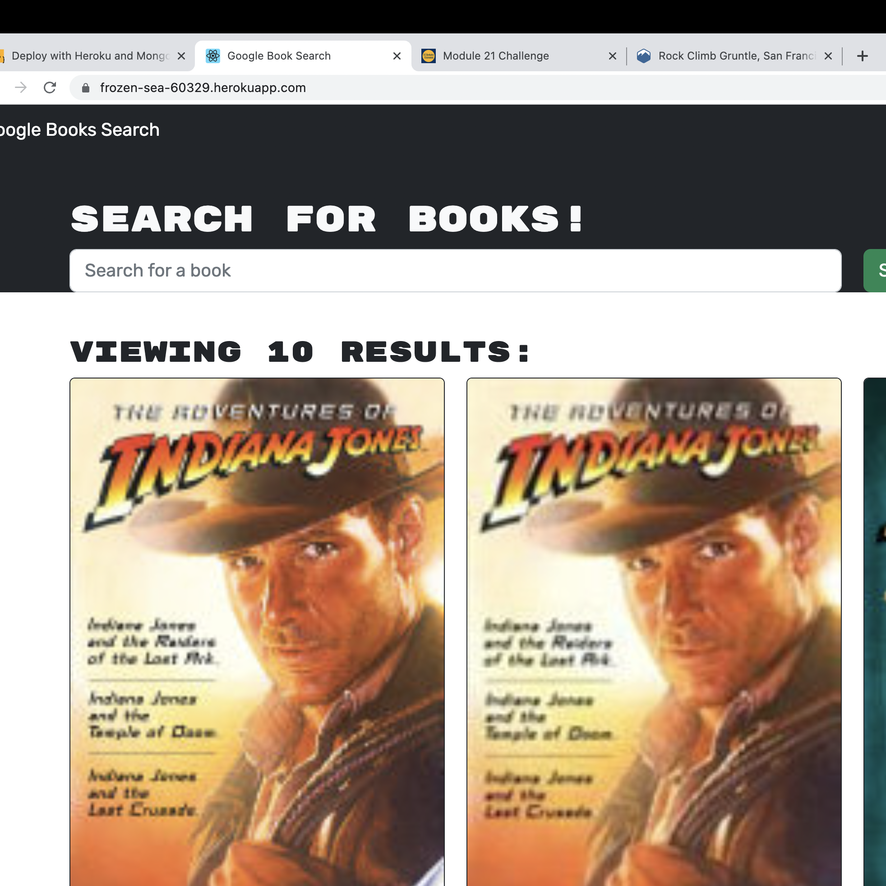

<h1>bookSearchEngine</h1>

## Table of Contents

  * [Description](#description)

  * [Usage](#usage)

  * [Image](#image)

  * [Links](#links)

  * [Questions](#questions)

## Description

- My motivation was to create a search engine so that a user could search any book and save it to a list of books they want to purchase.
- I built this project to learn more about GraphQL server and MongoDB.
- Learned how to write typeDefs, queries, mutation, and resolvers.js. 
- In addition I learned to use MongoDB and Sandbox. 

## Usage
  
 - Go to application url, create a sign-up.
 - Once logged, search for books in the search bar.
 - Save desired books to cart. Within cart you can remove any books from cart.

## Image
    
 

## Links

- GitHub Repo: https://github.com/Caliza/bookSearchEngine 
- Heroku: https://frozen-sea-60329.herokuapp.com/

## Questions

- For any additional questions on usage of application, please contact at rances.rodriguez@gmail.com.